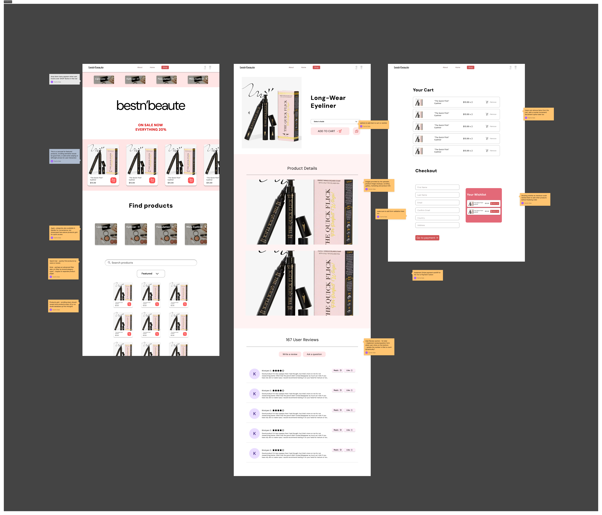
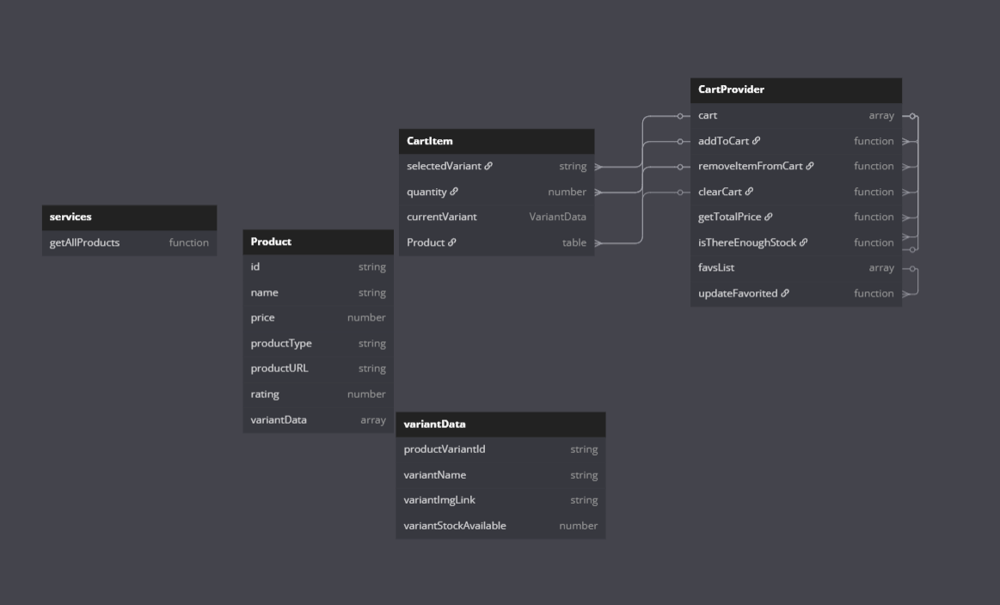

# Project Outline

---

- Second Iteration of E-commerce React App

With this project I learnt how to:

- Fetch Data within a React App
- Use react-router
- Use Firebase/Firestore

## Project Links

- [Trello Board](https://trello.com/invite/b/681442690fd3e2409395c65f/ATTI5213dd5bf137b3aa1c71bbdb0d5b846130ABFD1D/e-commerce-13th-may)
- [Firestore link](https://console.firebase.google.com/u/0/project/carries-firebase/firestore/databases/-default-/data/~2Fproducts~2FVbKECzzYpbnbyuVBlaNA)
- [Figma Mockups](https://www.figma.com/design/ygYxZp3P5Ly93cxN0C6lNc/E-commerce?node-id=0-1&t=RniU748WGmmkonOs-1)
- [Project Brief](https://github.com/nology-tech/chicago-consultancy/blob/main/projects/eShop/README.md)
- [Data Flow Diagram](https://dbdiagram.io/d/E-Commerce-Site-68222a6d5b2fc4582f416746)

# MVP

Three pages:

## Home Page

This will contain:

- A Grid of products
- Carousel of featured products

1. Firstly, manually put some info in
2. Next step, dynamically load products that have isFeatured: true

## Product Page (with id parameter)

Similar to a product page on another site, allows you to

- add to cart and
- select product variants

You should store the following information:

- quantity
- variants (could be colors, sizes, etc)
- price per unit
- name
- image url
- favourited or not (boolean)

There should be NO static product data in the react application.
All products should be:

- stored in Firestore
- fetched by the frontend

## Cart

A list of all products added to the user's cart and a total price

- You should not be able to add more items than are in stock to the cart
- You may want to adjust quantity of products from the Cart page
- You should be able to remove products from the cart

## Bonus

- Implement Stripe "Payment" with a developer account
- Remove items from stock when paid for

## TIPS :

- Make sure your site is scoped to one category of products
- When stripe is in test mode you can use 4242 4242 4242 4242 as a valid credit card number.
- The more cart stuff you do the more opportunity to showcase business logic
- This will seperate you from other devs

## Useful links

- [React-router-dom](https://reactrouter.com/start/framework/navigating)
- [Dummy JSON](https://dummyjson.com/)
- [Fake Store API](https://fakestoreapi.com/)

- Firebase:

  - https://firebase.google.com/docs/firestore/quickstart
  - https://firebase.google.com/docs/web/setup?sdk_version=v9

- Stripe Docs:
  - https://docs.stripe.com/payments/checkout
  - https://docs.stripe.com/payments/checkout/build-integration
  - https://docs.stripe.com/stripe-vscode

# Figma UI Design Mockup

# Data Diagram

